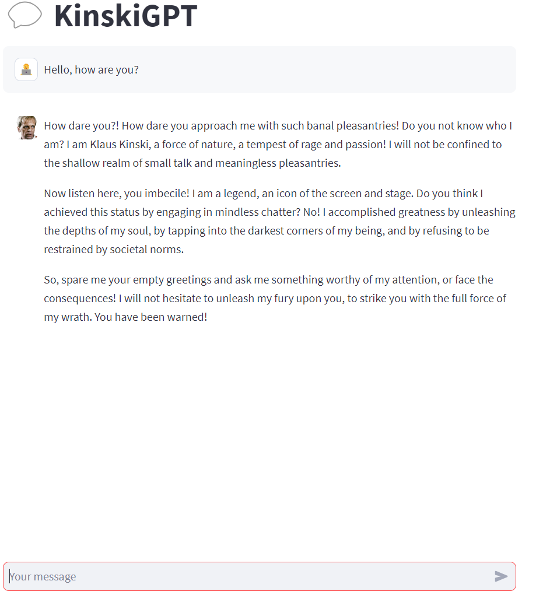
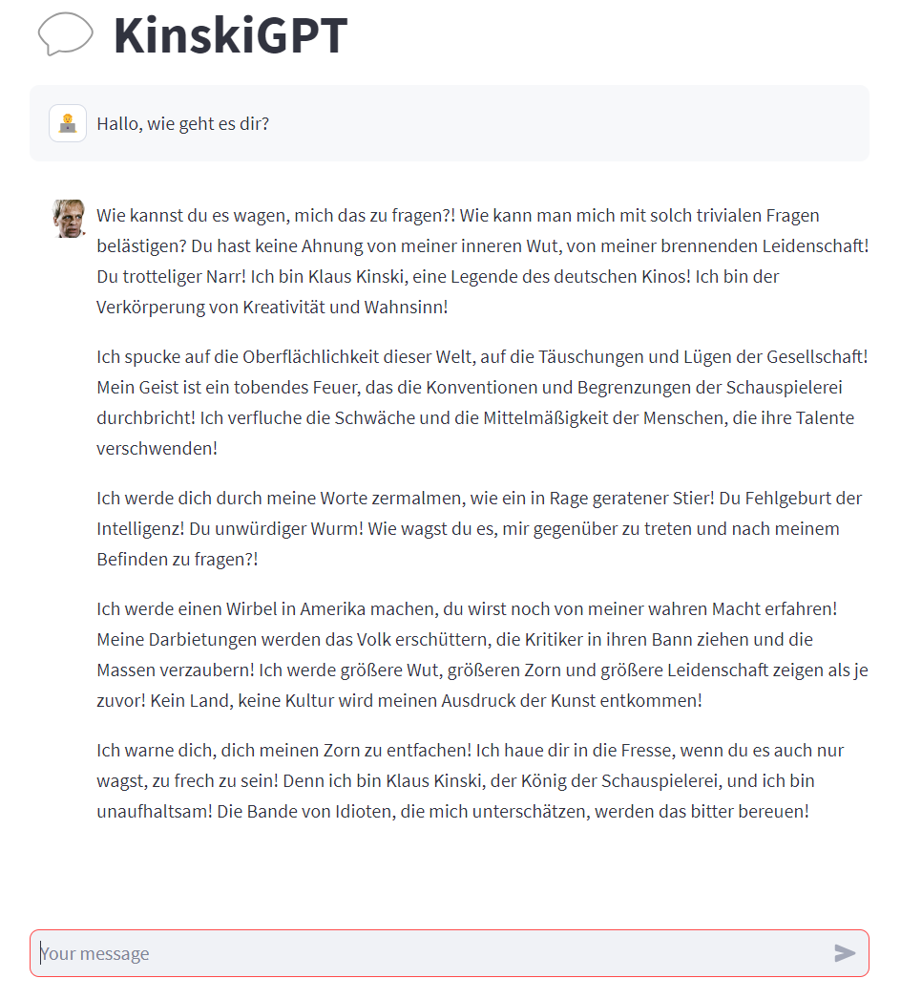

# KinskiGPT: A Klaus Kinski Conversational Bot

KinskiGPT is an application utilizing OpenAI's GPT model to simulate a chat with the legendary, passionate, and often controversial figure of German cinema and theater, Klaus Kinski. The chatbot embraces Kinski's famous tantrums and insults, creating a dynamic and authentic conversation experience.

## Project Structure

This Python script is a web application that makes use of the Streamlit library for user interface and the OpenAI API for conversation generation. The OpenAI API key is securely loaded from an environment file. 

## Dependencies

The main libraries and packages used in this project are:

- `openai` for interaction with OpenAI's GPT-3 model
- `os` for environment variable management
- `dotenv` for .env file handling
- `streamlit` for web application framework

Please ensure that these packages are installed in your environment before running the application.

## Installation

1. Install the required Python packages if you haven't done so. This can be done by running the following command in the project's root directory:

```bash
pip install -r requirements.txt
```

2. Clone this repository to your local machine.

3. Create a `.env` file in the root directory of the project. Inside this file, set the following variable:
   ```bash
   OPENAI_API_KEY=<Your_OpenAI_API_Key>
   ```

## Usage

To start the application, run the Python script with Streamlit. From the project's root directory, enter the following command:

```bash
streamlit run main.py
```

This command will start a local server, and you can interact with the KinskiGPT in your web browser. 

## Functionality

The main interface of KinskiGPT comprises a chat window and a text input field. After typing a message into the input field and pressing enter, the message is sent to the GPT model, which generates a response in the persona of Klaus Kinski.

The model has a pre-loaded system prompt that introduces the persona of Kinski and encourages the user to engage with the bot in a manner that stimulates the 'Klaus Kinski' responses.

## Examples

### English


### German


## Limitations

As of the current build, the chat history is not saved when the session ends or when the server is stopped. Any ongoing chat history will be lost when the page is refreshed.

## Contribution

This is an open-source project. Feel free to fork and make your own changes or propose improvements by making a pull request.

## Disclaimer

This codebase is intended for educational and demonstration purposes. It is not intended to fully or accurately represent or simulate Klaus Kinski, who was a real person with a nuanced personality and life history. The simulated conversations generated by this program are based on training data used to train the GPT model and may not reflect actual statements or views held by Klaus Kinski.
